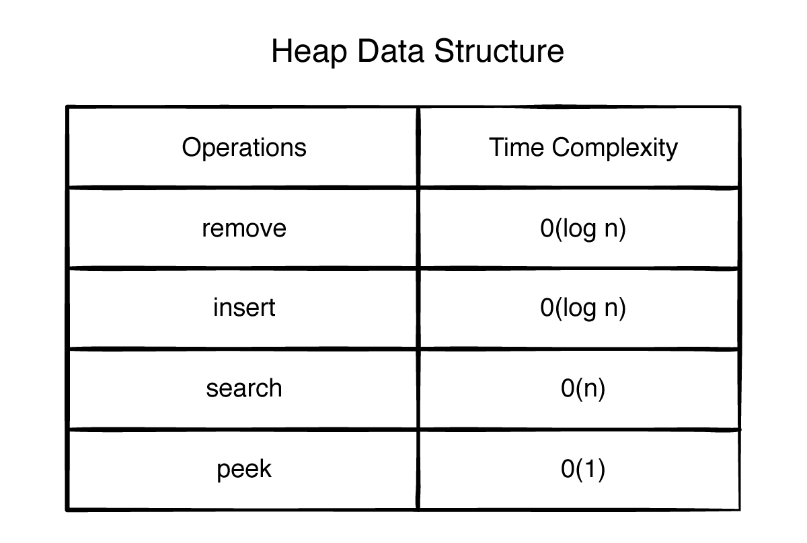

# Heap

A heap is a specialized tree-based data structure that satisfies the heap property. It is commonly used to implement priority queues and for efficient sorting (e.g., heapsort). Heaps are typically implemented as binary trees, but they can also be generalized to other tree structures.

### Key Properties of a Heap
#### Heap Property:

        In a min-heap, for every node i, the value of i is less than or equal to the values of its children.

        In a max-heap, for every node i, the value of i is greater than or equal to the values of its children.

#### Shape Property:

        A heap is a complete binary tree, meaning all levels are fully filled except possibly the last level, which is filled from left to right.

### Types of Heaps
#### 1. Min-Heap:

The smallest element is at the root.

Used in problems where the smallest element needs to be accessed quickly (e.g., Dijkstra's algorithm).

#### 2. Max-Heap:

The largest element is at the root.

Used in problems where the largest element needs to be accessed quickly (e.g., scheduling tasks by priority).

### Operations on a Heap
#### 1. Insertion:

Add the new element at the bottom-rightmost position to maintain the complete tree property.

"Heapify up" (or "bubble up") to restore the heap property by swapping the new element with its parent until the heap property is satisfied.

#### 2. Deletion (Extract Min/Max):

Remove the root element (min or max, depending on the heap type).

Replace the root with the last element in the heap.

"Heapify down" (or "bubble down") to restore the heap property by swapping the element with its smallest (min-heap) or largest (max-heap) child until the heap property is satisfied.

#### 3. Peek:

Access the root element without removing it.

#### 4. Heapify:

Convert an arbitrary array into a heap. This is done by starting from the last non-leaf node and performing "heapify down" operations.

### Time Complexity

        Insertion: O(log n)

        Deletion: O(log n)

        peek: O(1)

        Heapify: O(n) -> Building heap from an array

### Applications of Heaps

#### * Priority Queues:

Heaps are the underlying data structure for efficient priority queue implementations.

#### * Heapsort:

A comparison-based sorting algorithm that uses a heap to sort elements in 

O(nlogn) time.

#### * Graph Algorithms:

Used in algorithms like Dijkstra's shortest path and Prim's minimum spanning tree.

#### * K-th Largest/Smallest Element:

A min-heap or max-heap can be used to efficiently find the k-th largest or smallest element in a stream of data.

  
  

A heap is a powerful data structure for managing data with priorities. Its efficient operations and simple implementation make it a popular choice for many algorithms and applications.

